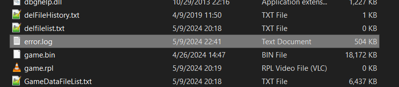
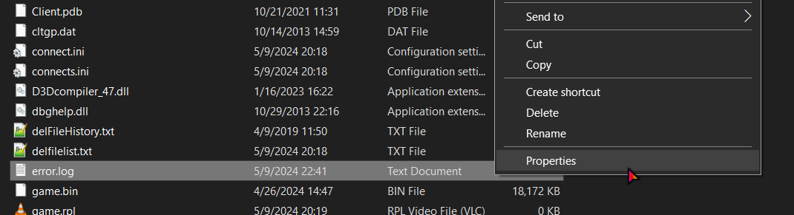
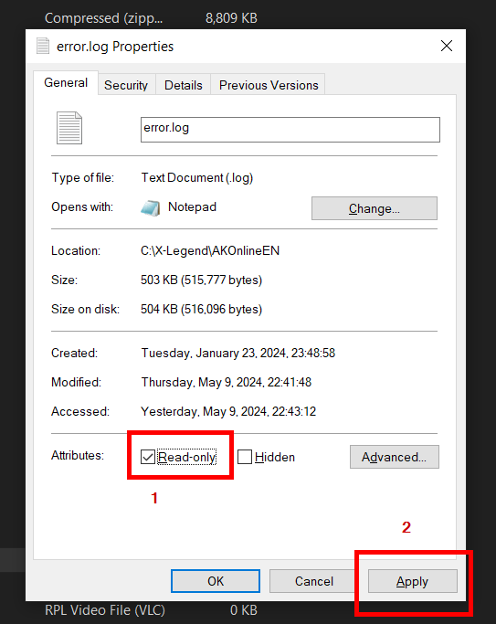

# Archive Lag
Archive lag is that dumb thing that happens when you are in a dungeon/instance and you get massive lag spikes. If you are playing Dawn Passage or something and can't get up carts, this is why.

## Fix
1. Find Aura Kingdom. For me this is in `C:\X-Legend\AKOnlineEN`
2. Find `error.log` in the main directory of the game.

    
    This should be in the same spot for everyone. I'm using Windows 10 here, but the file is there for all OS/versions with this problem.

3. Open properties of `error.log`
    

4. Set the file to read-only. Make sure to click apply afterwards
    

That's it. You should no longer have archive lag. You can do this without restarting the game, since the error occurs from the game attempting to write to it a bajillion times.

## What causes this
The game writes to `error.log` every time anything really happens in the game. You can find a list of your deaths/revives/etc. The trouble is that Aura Kingdom is kind of a single-threaded game, so it can't write to the file and do other things at the same time. This causes the game to lag while it writes to the file. Something about instances (and riding your mount into wood barriers) causes the game to freak out and start sending constant errors. 

Of course, once this starts happening, the game feels the need to write it all to the file, and thus your game lags while it waits for the file to be written to. 

By making the file read-only, we prevent the game from writing to it, and thus prevent the lag. The game will still try to write to it, but the OS will refuse to give the process write access and the game logic will fail out, allowing us to progress without crippling lag.