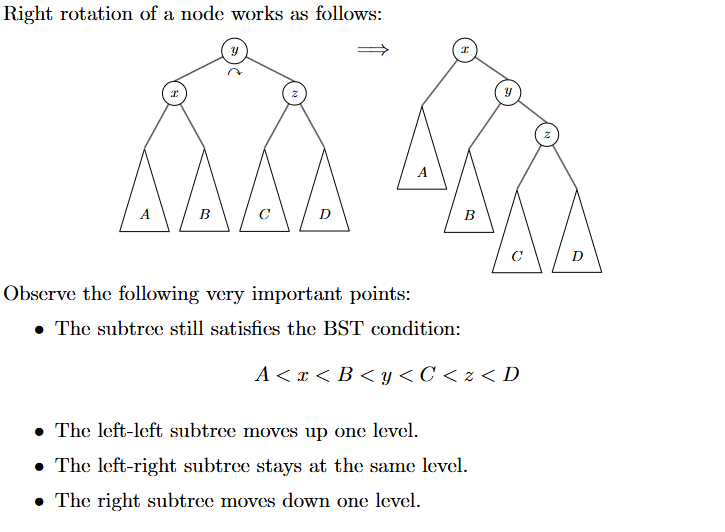

# Intro
We now move on to a slightly more complex data structure, the AVL tree. The AVL tree is a self-balancing binary search tree, and is a more efficient version of the BST.

# AVL
The AVL tree, named after its inventors Adelson-Velsky and Landis, is a self-balancing binary search tree. It's a more efficient version of the BST, and is guaranteed to have a height of `O(log n)`. This is because the AVL tree is balanced, meaning that the height of the left and right subtrees of any node differ by at most 1. Otherwise, it functions exactly like a BST.

## Definition
AVL trees hold the exact definition of a BST, with the added condition that the height of the left and right subtrees of any node differ by at most 1. That is, a tree is an AVL tree if it is both a binary search tree and satisfies the AVL property.

## Use Cases
The AVL tree is used in situations where we need to maintain a sorted list of elements, but also need to insert and delete elements. The AVL tree is more efficient than the BST in this case, because it is guaranteed to have a height of `O(log n)`, and so we get `O(log n)` insertions and deletions as opposed to potentially `O(n)` in the BST.

## Functionality
Although AVL trees also primarily maintain functionality via insert and delete, the AVL tree has an additional operation called "rebalancing", in order to maintain the AVL property. We do this via a function called rotate.

The primary function of rotate is to shift around nodes within a branch in such a way that it preserves BST order while using minimal operations. We have the following rotations:
- A right rotation takes a parent node y, and two child trees with parent nodes x and z, and creates a new structure by shifting the entire axis right along the center node y. To illustrate, I will be using excerpts of the tex notes by Justin Wyss Gallifent at UMD



- A left rotation is the same as a right rotation, but in the opposite direction.


## Preliminaries
We'd like to create an overarching structure to use for the tree, and then implement methods to turn that tree into a BST. Since a tree can be represented as a collection of linked nodes with children, we'll start with that.

Having a key value pair is traditional in data structures, since often times we have both a "search key" and a "value" that we want to store. Take a file structure for instance, where the name (or more specifically the path) of the file is the key, and the file content itself is the value.

```python
class Node():
    def  __init__(self,
                  key        : int  = None,
                  value      : int  = None,
                  leftchild  : Node = None,
                  rightchild : Node = None):
        self.key        = key
        self.value      = value
        self.leftchild  = leftchild
        self.rightchild = rightchild
```
This node class is pretty simple.

## Insertion
Since our BST is just a simple BST, the insert idea is also very simple. Let's first define a template for our data structure. Ideally, we want a class that can represent all nodes in the tree. This node should have a left and right child, and a key value pair. 

```python
# For the tree rooted at root and the key and value given:
# Insert the key/value pair.
# The key is guaranteed to not be in the tree.
def insert(root: Node, key: int, value: int) -> Node:
    if root is None: 
        # if root is none then we are building tree
        return Node(key, value)
    cur = root # traversal setup
    while True:
        if key < cur.key:
            # if it's less and there is no left child then we can insert
            if cur.leftchild is None:
                cur.leftchild = Node(key, value)
                break
            # else recursively go into the left child
            else:
                cur = cur.leftchild
        else:
            # similar
            if cur.rightchild is None:
                cur.rightchild = Node(key, value)
                break
            else:
                cur = cur.rightchild
    return root
```
The insert method is pretty simple. We just traverse the tree until we find a place to insert the key. If the key is less than the current node, we go left, else we go right. If we hit a `None` child, we insert the key there, since we are then at a leaf. Additionally note that we include a base case, because you will find that our initializer for the tree simple includes just declaring a None node and passing in the key and value.

## Deletion
Deletion is a bit more complex. Consider the following:
- If the node has no children, we can just delete it.
- If the node has one child, we can just replace the node with the child.
- If the node has two children (eg it's a true parent node), it gets complex. Say we delete the node. How do we then "rebalance" or move around the 2 child trees so that the BST property is still maintained? It turns out that the easiest option is to find a replacement node from within the tree. Note that this option needs to be in between the left and right child of the node we are deleting. 

How do we find this replacement node? We can either find the maximum of the left subtree or the minimum of the right subtree. These two are the only nodes guaranteed to be in between any of the nodes of the left tree, and any of the nodes of the right tree.

If you picture the children as sets of numbers on a line, and note that the deleted node is in the center, this may be more apparent. 

In this method we use what is called the "inorder successor", or the minimum of the right subtree. It's called such because if you were to do an inorder traversal, this number would be immediately succeeding the deleted node. 

```python
# Helper function to find the inorder successor
# by finding the minimum of a tree. We will pass in
# the right subtree child of the node we are deleting.
def findminnode(node: Node) -> Node:
    cur = node
    while cur.leftchild is not None:
        cur = cur.leftchild
    return cur

# For the tree rooted at root and the key given, delete the key.
# When replacement is necessary use the inorder successor.
def delete(root: Node, key: int) -> Node:
    if root is None:
        return root # base case 
    # we look by key. key should be inorder so we use bs to find it 
    if key < root.key:
        root.leftchild = delete(root.leftchild, key)
    elif key > root.key:
        root.rightchild = delete(root.rightchild, key)
    else: # case that key=root.key 
        if root.leftchild is None: 
            return root.rightchild
        elif root.rightchild is None:
            return root.leftchild
        # inorder successor nonsense 
        # set key to smallest of right child
        tmp = findminnode(root.rightchild) # returns a node
        root.key = tmp.key
        root.value = tmp.value
        # deletus the inorder tmp!!
        root.rightchild = delete(root.rightchild, tmp.key)
    return root
```
Note that once we find the inorder successor, we replace the key and value of the node we are deleting with the key and value of the inorder successor. We then delete the inorder successor, which is, as it turns out, guaranteed to be either a leaf node or only have 1 child to the right (since it can't have a left child, as it's the smallest in that set already).

## Search
Search is trivial. We just traverse the tree until we find what we want. 
```python
# For the tree rooted at root and the key given:
# Calculate the list of values on the path from the root down to and including the search key node.
# The key is guaranteed to be in the tree.
# Return the json.dumps of the list with indent=2.
def search(root: Node, search_key: int) -> str:
    value_list = []
    def search_helper(node: Node, search_key: int) -> bool: # im using bool to flag when to break
        if node is None: # base case
            return False
        value_list.append(node.value)
        if node.key == search_key: # we found the key and can return with the value_list complete
            return True
        if search_key < node.key:
            return search_helper(node.leftchild, search_key)
        elif search_key > node.key:
            return search_helper(node.rightchild, search_key)
    # i've been looking at the word "search" for too long and now it looks stupid
    search_helper(root, search_key)
    return value_list
```
And we have a simple search function that returns the path to the key.

## Closing Thoughts
This is a simple implementation of a BST. It's not the most efficient, but it's a good starting point. We can improve this by balancing the tree, which we will discuss in a future post. I hope you learned something; although hopefully the concepts were already familiar to you, since a BST is by far the most basic structure I intend to go over. Also, if I feel good after finishing this series, I may start one on binary exploitation. 
