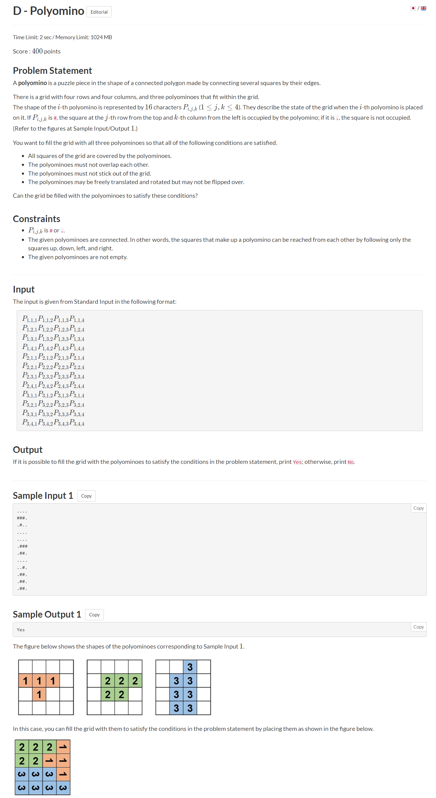

# TOC
- [TOC](#toc)
- [The Problem](#the-problem)
- [Technical Details](#technical-details)
- [Approach](#approach)
  - [Initial Thoughts](#initial-thoughts)
  - [How to Fit?](#how-to-fit)
  - [The DFS function](#the-dfs-function)
- [Solution](#solution)
- [Thoughts](#thoughts)

# The Problem

I present to you today the Polyomino problem from an AtCoder contest I did. This was the prompt provided



The problem immediately struck me as being relatively complex, and I wanted to walk through the interesting approaches made to solve it. For those interested in the final solution, you may want to consider skipping ahead.

# Technical Details

This was completed as part of an atcoder competition, so I'll be working with C++ and typical competitive programming rules here. I specifically wrote this code under some time duress, so apologies if it's a little bit scuffed.

# Approach

As you may have noticed, the problem is immediately very complex. We receive 3 4 by 4 "input images" of our polyominos, and we first need to be able to read those. That was relatively simple, and I decided to go with a vector array of strings to scan these in due to how manipulatable they are.

Then, we must determine whether or not they can be put in a grid together.

Initial Thoughts
----------------
It's immediately obvious that there are some conditions where we instantly fail. For instance, if there are not enough `#`'s inputted to actually fill a square, then we can instafail. Additionally, since the polyominos can be manipulated under translation and rotation, we need a rotation algorithm. Let's get some basics out of the way first.
```cpp
// INPUT
vector<array<string, 4>> g(3);

for (auto &it: g) {
    for (auto &i: it) {
        cin >> i;
        cnt += count(i.begin(), i.end(), '#');
    }
}
``` 
The input method is extremely basic. We just define our vector array of strings, and read them in. We also track how many `#`'s are inputted so we can check if there are 16 of them, as mentioned earlier. I used `auto &i : it`, the easy range for conditional, to make things easier. You could of course do this with a more traditional iterator.
```cpp
auto rotate = [](const array<string, 4> &a) {
    auto b = a;
    for (long long i = 0; i < 4; i++) {
        for (long long j = 0; j < 4; j++) {
            b[j][3 - i] = a[i][j];
        }
    }
    return b;
};
```
And this is the rotate function. Notice that I just defined it within main. The algorithm itself is very simple; we create a new array b, which is initially uninitialized, and then transpose characters 1 at a time at a 90 degree rotation into b. Since we know the size of the array, we can just iterate over a for loop. In retrospect using an ll iterator was a waste of memory but it's just a product of the int->ll macro I had.

How to Fit?
-----------
The question of how to fit the polyominos into the actual square was the harder part. My initial naive approach was to try every single possible rotation and location. In actuality, there is no  "logical" way to determine how a puzzle piece fits into a puzzle. In the classical jigsaw puzzle question, and assuming there isn't information on what color something is, for instance, our solutions typically involve either the naive approach of trying everything or to create an adjacency matrix of what fits against what and then pruning it.

However, in this problem an adjacency matrix doesn't make much sense. We don't care so much about how pieces fit together with each other, as whether or not they're all able to, within a 4x4 array. In this case, each piece has 4 rotations and 16 theoretical locations at most. That is, the worst case scenario checks `4^16^3` possibilities. This is insane, and we don't want to try this.

Let's think of a way to reduce this.

We can treat the problem like a search and create a dfs algorithm. This algorithm will look at each possible rotation, and on each one attempt to fit them into the block in a way that satisfies the solution. However, to minimize the amount of checks we make, we want to retain "memory" of what is actually possible.

To do this, I defined a 2d array "page" where we put the imaginary blocks. The page will be a reference point of where a "valid" placement of a block has already been found.

Writing a fit algorithm is actually relatively easy. we can just check all 16 locations and if the page is blank and the input polyomino is there, we can slot it in. Making sure to check for edges and other edge checks, we get this
```cpp
auto fit = [&](long long k, long long x, long long y) {
    for (long long i = 0, x_iter = x; i < 4; i++, x_iter++)
        for (long long j = 0, y_iter = y; j < 4; j++, y_iter++) {
            if (g[k][i][j] == '.') {
                continue;
            }
            if (page[x_iter][y_iter] == '#') {
                return 0;
            }
            if (x_iter < 0 or x_iter > 3 or y_iter < 0 or y_iter > 3) {
                return 0;
            }                
            page[x_iter][y_iter] = '#';
        }
    return 1;
};
```
It's a pretty simple solution. 

The DFS function
----------------
There are plenty of different possibilities however, so we have to write the dfs function in a way that allows us to look at various possible fits and rotations. I wrote it in a recursive manner, where the base case is either failing after all rotations have been tried or when a spot has been found. I used a tmp variable to temporarily "save" the page, and if it's valid I would "replace" it.
```cpp
auto dfs = [&](auto &&self, long long i) -> bool {
    if (i == 3) {
        return 1;
    }
    auto tmp = page;
    for (long long x = -3; x <= 7; x++) {
        for (long long y = -3; y <= 7; y++) {
            for (long long t = 0; t < 4; t++) {
                if (fit(i, x, y) and self(self, i + 1)) {
                    return 1;
                }
                g[i] = rotate(g[i]); 
                page = tmp;
            }
        }
    }
    return 0;
};
```
Using tmp to save the page allows me to only take pages that are successful. We try to fit the shape in from -3 to 7 because the polyomino we receive as input isn't always started at `input[0][0]`, so to speak. It could be at the input's `input[2][3]`, at which point given how the fit algorithm is written we'd have to start at -2, -3. Since it can only be at most 3 to either side, we go from the range `(0, 4)` to `(-3, 7)`.

Then, we try all 4 rotations of the shape and check if it fits. If it doesn't, we rotate it and try again. Notice that our input structure `g` only has 3 elements (since we took in 3 polyominos) so we have to halt the recursion after all 3 have been rotated 4 times. These 3 functions are actually sufficient to solve the problem!

# Solution

Now, let's put it all together. I used a simple check at the end to determine whether or not the polyominos would fit, at which point I would print YES or NO correspondingly. 

```cpp
#include <bits/stdc++.h>

using namespace std;

int main() {
    vector<array<string, 4>> g(3);
    array<array<char, 4>, 4> page;
    // unrelated note but count is actually a function
    // name in stdc. mildly infuriating.
    long long cnt = 0;
    // taking input to the problem
    for (auto &it: g) {
        for (auto &i: it) {
            cin >> i;
            cnt += count(i.begin(), i.end(), '#');
        }
    }
    // rotate function
    auto rotate = [](const array<string, 4> &a) {
        auto b = a;
        for (long long i = 0; i < 4; i++) {
            for (long long j = 0; j < 4; j++) {
                b[j][3 - i] = a[i][j];
            }
        }
        return b;
    };
    // fit. note that page is global here so it can be used by
    // both fit and dfs. this is important because
    // we want it to "remember" what works.
    auto fit = [&](long long k, long long x, long long y) {
        for (long long i = 0, x_iter = x; i < 4; i++, x_iter++)
            for (long long j = 0, y_iter = y; j < 4; j++, y_iter++) {
                if (g[k][i][j] == '.') {
                    continue;
                }
                if (page[x_iter][y_iter] == '#') {
                    return 0;
                }
                if (x_iter < 0 or x_iter > 3 or y_iter < 0 or y_iter > 3) {
                    return 0;
                }                
                page[x_iter][y_iter] = '#';
            }
        return 1;
    };
    // This is the search. We stop at i=3, which is kind of
    // the "accumulator"-esque part of the recursion.
    auto dfs = [&](auto &&self, long long i) -> bool {
        if (i == 3) {
            return 1;
        }
        auto tmp = page;
        for (long long x = -3; x <= 7; x++) {
            for (long long y = -3; y <= 7; y++) {
                for (long long t = 0; t < 4; t++) {
                    if (fit(i, x, y) and self(self, i + 1)) {
                        return 1;
                    }
                    g[i] = rotate(g[i]); 
                    page = tmp;
                }
            }
        }
        return 0;
    };
    // If the count isn't 16, we can auto fail.
    // Only then do we call dfs. 
    // Note if cnt isn't 16 then dfs never runs. 
    if (cnt == 16 and dfs(dfs, 0)) 
        printf("Yes\n");
    else
        printf("No\n");
    return 0;
}
```

# Thoughts

The problem was really interesting to solve during the time pressure of a competition. In retrospect, the code could have been a lot cleaner. For instance, I could have redesigned the dfs code to not be so for loop intensive, since it deterministically goes through 400 recursions every layer. 

Additionally, I think that you can tell the code was very clearly written for competitive programming. After all, there's so much `auto` used. 

I think that the problem demonstrates how "geometric" problems that we typically use human intuition for (should you approach a problem like this in real life, we tend to just "intuit" possible block placements, and don't really think about why our brains can conduct such pattern recognition so efficiently) can be solved more easily through compartmentalization. This problem was relatively simple, with many constraints and a small "puzzle" size. Yet it still required multiple compartmentalizations and solutions for each of them.

